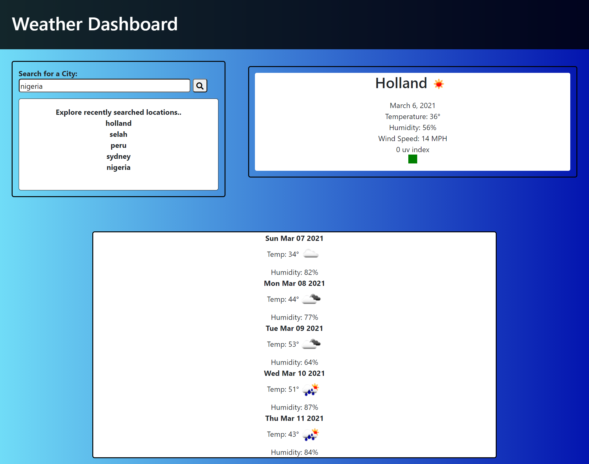

# Weather Board

## Overview

HTML

For this file, I created the elements that would be permanently displayed on the page. I then created sections for my fetched data/javaScript elements to be appended to. Lastly, I styled my webpage and used as much bootstrap as I could before editing the webpage in the CSS file.

CSS

For this file, I tried a gradient background, filled in the styling that I couldn't do with bootstrap, and created the five colors and sizes for the uv index box. 

JavaScript

For the JavaScript file, I mainly used jquery. I started by creating an onload function and from there, I started my fetching. I created a function with a URL, created elements that contained data from the URL and appended those elements to my desired sections. Next, I did the same thing for the 5 day forecast. Last, I made it so the searched cities saved to local storage.

## Deployed Link

https://hstor3.github.io/weather-dashboard/

## Screenshot 

